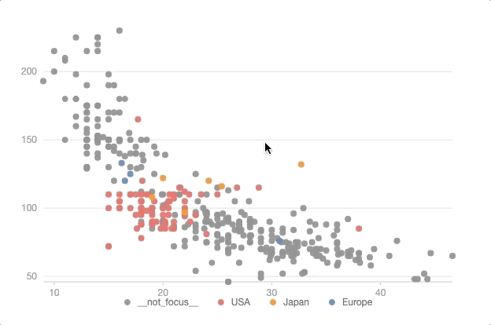

# RxG2


Responsive G2 (RxG2) is a responsive visualization extension of AntV/G2 that is wrapped with RxJS. It allows you to write responsive visualizations in functional reactive programming (FRP) style. This also expands the possibilities of G2's interactive graphics syntax (for data visualization, G2's current interactive syntax is more like G-level interactive syntax, which is more focused on the basic interactive behavior of graphics, rather than the visualization aspect).

Based on RxJS streams, the abstraction of asynchronous interactive behavior allows you to implement complex visualization interaction logic without spending too much effort maintaining interaction-related states.

## Related Resources
+ [Learn Rxjs](https://rxjs-dev.firebaseapp.com/guide/overview)
+ [Learn AntV/G2](https://g2.antv.vision/zh/docs/manual/about-g2)

G2 provides a declarative visualization interface based on graphic syntax, which allows you to quickly implement complex visualizations with concise code. However, when using G2 to handle some visualization interactions, this simplicity is often disrupted by a large amount of external state and callback functions, which undermines the beauty of graphic syntax itself. Is it possible to extend G2, retaining its original aesthetic appeal, and at the same time, enabling the construction of interactive visualizations in a similarly concise and elegant manner?

RxG2, inspired by Vega, uses the form of signals/predicates/transforms in Vega to abstract asynchronous behavior in visualization. Fortunately, we can directly utilize the capabilities of RxJS to implement this mechanism, while compared to Vega, which requires customizing a complex DSL to support this mechanism, RxJS allows you to develop directly with JavaScript. We have also made some modifications to the existing interfaces using Observables, which makes it easier for you to use RxJS for complex interactive behavior extensions in the future.

## Usage
```bash
npm i --save rxg2
```

## Examples
Implement the interactive effect shown in the figure, i.e., when the mouse hovers over a point, all points with the same 'origin' category as that point should be highlighted.



with rx-g2

```ts
import { GREY_CAT_VALUE, ObservableChart, Utils } from 'rxg2';
import * as op from "rxjs/operators";

const dataSource$: Observable<IRow[]> = from(fetch("/cars.json").then((res) => res.json())).pipe(
    op.startWith([])
);
// declare vars
const xVar$ = createVariable(dataSource$, "Miles_per_Gallon");
const yVar$ = createVariable(dataSource$, "Horsepower");
const colorVar$ = createVariable(dataSource$, 'Origin')

// init chart
const rxChart = new ObservableChart();

const selection$ = rxChart.useSelection({
    target: 'element',
    type: 'single',
    on: 'mouseover',
});

// define predicates from interaction(concept in vega)
const predicates$: Observable<IFilter[]> = selection$.pipe(
    op.map((rows) => [Utils.createFilter('Cylinders', 'in', rows.filter((row) => row !== null) as IRow[])])
);

// declare color as a variable streamed by interaction
// rx-g2 allows you to map any visual channels to a dynamic variable, instead of a contant column key
const color$ = combineLatest([predicates$, colorVar$, dataSource$]).pipe(
    op.map(([predicates, origin, dataSource]) => {
        return dataSource.map((row, rIndex) => {
            if (Utils.rowFilteredOut(row, predicates)) return GREY_CAT_VALUE;
            return origin[rIndex];
        });
    })
);
// config chart
rxChart.geom('point').position([xVar$, yVar$])
    .color(color$);

rxChart.data(dataSource$);

rxChart.render();
```

comparing with the original implementation, it allows you to change contant column key to a stream/signals/variable, with declarative graphics of grammar.
```ts

fetch('/cars.json').then(res => res.json()).then(res => {

    chart.point().position('Miles_per_Gallon*Horsepower')
    .color('Origin')

    chart.data(dataSource)

    chart.render();
})

```

## Reference

RxG2 is inspired by reactive vega and vega-lite

+ Satyanarayan, Arvind, et al. "Reactive vega: A streaming dataflow architecture for declarative interactive visualization." IEEE transactions on visualization and computer graphics 22.1 (2015): 659-668.

+ Satyanarayan, Arvind, et al. "Vega-lite: A grammar of interactive graphics." IEEE transactions on visualization and computer graphics 23.1 (2016): 341-350.
