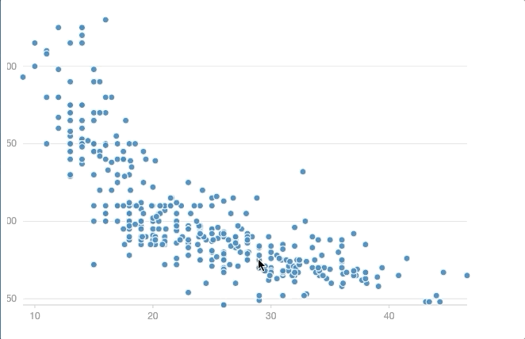

# RxG2


响应式G2(RxG2)，是使用rxjs封装的响应式的antv/g2的可视化扩展。它使你可以使用类似vega的形式，编写响应式的可视化图表。这也为G2拓展了交互式图形语法的可能（针对数据可视化，G2目前的交互语法其实更像是G层面的交互语法，其更关注图形的基础交互行为，而非可视化层面）。

基于rxjs的流对异步交互行为的抽象使你在实现复杂可视化交互逻辑时可以不需要花费过多的经历维护交互相关的状态。

## 相关资料
+ [了解Rxjs](https://rxjs-dev.firebaseapp.com/guide/overview)
+ [了解AntV/G2](https://g2.antv.vision/zh/docs/manual/about-g2)

G2提供了一套基于图形语法的声明式的可视化接口，它使得你可以用简介的写法快速实现复杂的可视化。但当你使用G2处理一些可视化的交互行为时，这种简洁之美就会被破坏掉，大量的外部状态和回调函数破坏了图形语法本身的美感。那能否对G2进行扩展，在保留其原始的使用美感的同时，能用同样简洁优雅的形式来构建交互式的可视化。

受到Vega的启发，rx-g2使用了vega中的signals/predicates/transform的形式来抽象可视化中的异步行为。幸运的是，我们可以直接借助rxjs的能力实现这一机制，同时相比vega需要自定义一套复杂的dsl来支持这种机制，rxjs允许你直接使用JavaScript进行开发，我们也将一些原有的接口做了Observable的改造，这也使得你可以后续更自由的使用rxjs进行复杂交互行为的扩展。

## 使用
```bash
npm i --save rxg2
```

## 案例
实现下图的交互效果，即当鼠标覆盖在一个点上时，能够高亮出和他origin类别相同的所有点。



使用rx-g2的写法

```ts
import { GREY_CAT_VALUE, ObservableChart, Utils } from 'rxg2';
import * as op from "rxjs/operators";

const dataSource$: Observable<IRow[]> = from(fetch("/cars.json").then((res) => res.json())).pipe(
    op.startWith([])
);
// 声明变量
const xVar$ = createVariable(dataSource$, "Miles_per_Gallon");
const yVar$ = createVariable(dataSource$, "Horsepower");
const colorVar$ = createVariable(dataSource$, 'Origin')
// 初始化图表
const obChart = new ObservableChart(chartContainer, 600, 400);
// 定义图表交互事件产生的predicates,vega中的概念，类似对selection的特征描述，由一堆筛选器构成。
const predicates$: Observable<IFilter[]> = obChart.selection$.pipe(
    op.map(rows => [Utils.createFilter('Origin', 'in', rows)])
)
// 定义颜色为一个随交互行为变化的变量,
// rx-g2允许你对任何映射到视觉通道上的字段可以升级为一个更为动态变量，而不是写死于一个数据集中已有的常量字段
const color$ = predicates$.pipe(
    op.withLatestFrom(colorVar$, dataSource$),
    op.map(([predicates, origin, dataSource]) => {
        return dataSource.map((row, rIndex) => {
            if (Utils.rowFilteredOut(row, predicates)) return GREY_CAT_VALUE;
            return origin[rIndex]
        })
    })
)
// 配置图标
rxChart.geom('point').position([xVar$, yVar$])
    .color(color$);

rxChart.data(dataSource$);

rxChart.render();
```

对比原生的写法，只是把静态的字段绑定变成了一个流的绑定。整体的书写习惯还沿用了G2的写法。
```ts

fetch('/cars.json').then(res => res.json()).then(res => {

    chart.point().position('Miles_per_Gallon*Horsepower')
    .color('Origin')

    chart.data(dataSource)

    chart.render();
})

```